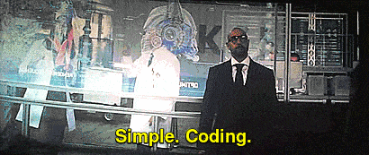
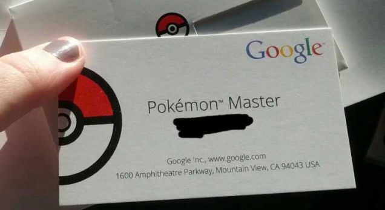
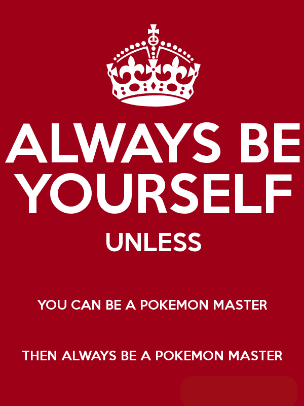

Project Euler
==============

Personal repository for Project Euler solutions implemented in various languages.

| Name:    | Email:               | Year: | License:                 |
|----------|----------------------|-------|--------------------------|
| Sang Han | jjangsangy@gmail.com | 2014  | [Apache License Version   2](https://github.com/jjangsangy/Project-Euler/blob/master/LICENSE) |

# The Journey of become a better Programmer

The sole existence of this repository is for personal motivation to become the greatest
Code master that no one ever was.

1. Keep track of how you learn certain types of things best.
2. Apply that knowledge to this problem domain
3. When possible build off of something you do know well.
4. Involve others who do "get it." Learn from them. Choose competent yet patient people.
5. Stick with it. This is not an easy subject to master.

## How to Learn and Get Better

### Questioning:
Question everything, do this till the end of your life.
If something is happening that you don't understand, ask why. Then ask why that is. Then go away and research alternatives, and propose them. Ask questions until you could explain in complete detail.

### Incremental Development
Build stuff incrementally .
Try to get something running end to end first with either proxies or mock code and then I fill in the details.

### Read code
Read code.
A lot inside and outside. Reading code is the path that unlocks other skills.

### Enjoy the Process
Playing is when you are focused on the process, rather than the goal.
When you are playing, it is ok to make mistakes. It is ok to change the rules.
When you are playing, you are constantly learning.
In fact, I would conjecture, that real learning (not memorization) can only happen while playing.

# Gotta, Code them All!

# Data Structures & Algorithms

This repository is also a repository housing the useful data structures and algorithms implemented
in multiple languages that I've kept. I can't ever claim to own a tree sort like BFS
much like a Pokemon Master doesn't actually own their Pokemon. For the sake of training
I don't copy-paste code as little as possible.

The key to a solid foundation in data structures and algorithms is not an exhaustive survey of every conceivable data structure and its subforms, with memorization of each's Big-O value and amortized cost. Such knowledge is great and impressive if you've got it, but you will rarely need it. For better or worse, your career will likely never require you to implement a red-black tree node removal algorithm. But you ought be able—with complete ease!—to identify when a binary search tree is a useful solution to a problem, because you will often need that skill.

> Thinking outside the box only works if you know everything inside it.

# Learn to be A Master

> Everyone thinks of changing the world, but no one thinks of changing himself
>
> Leo Tolstoy (1828-1910)

